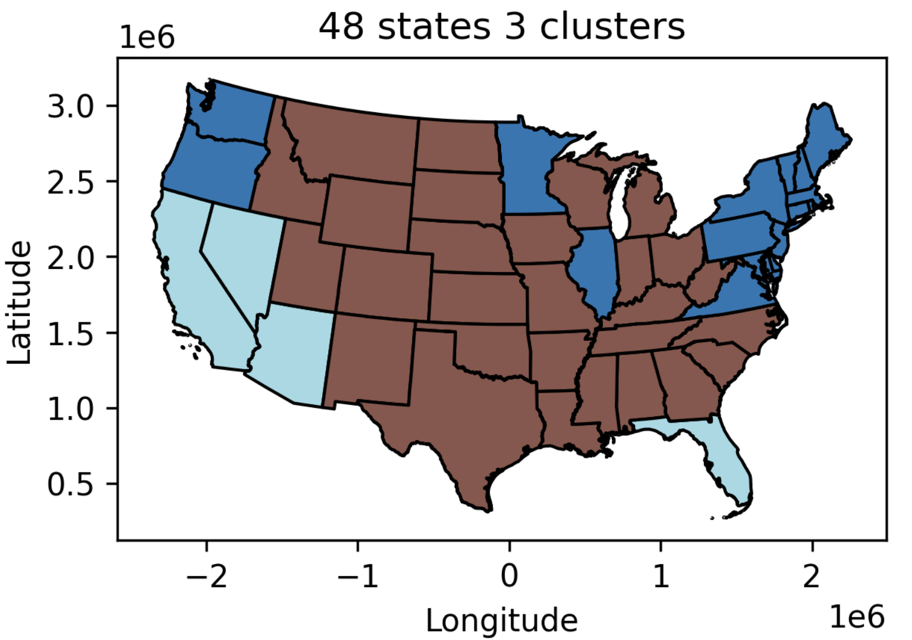
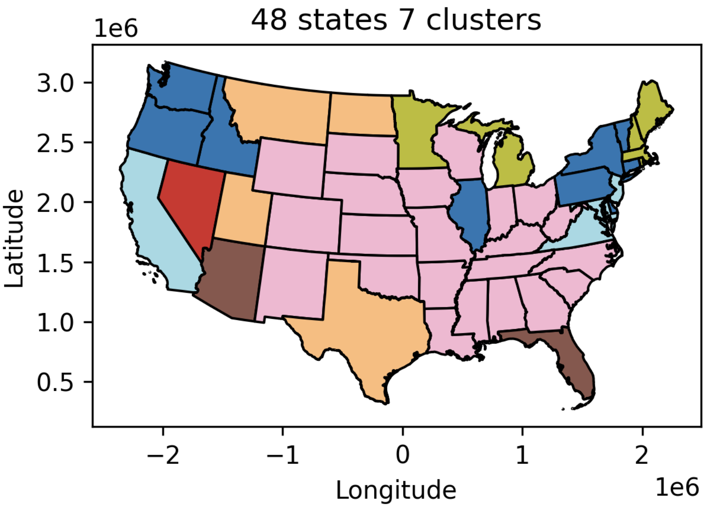
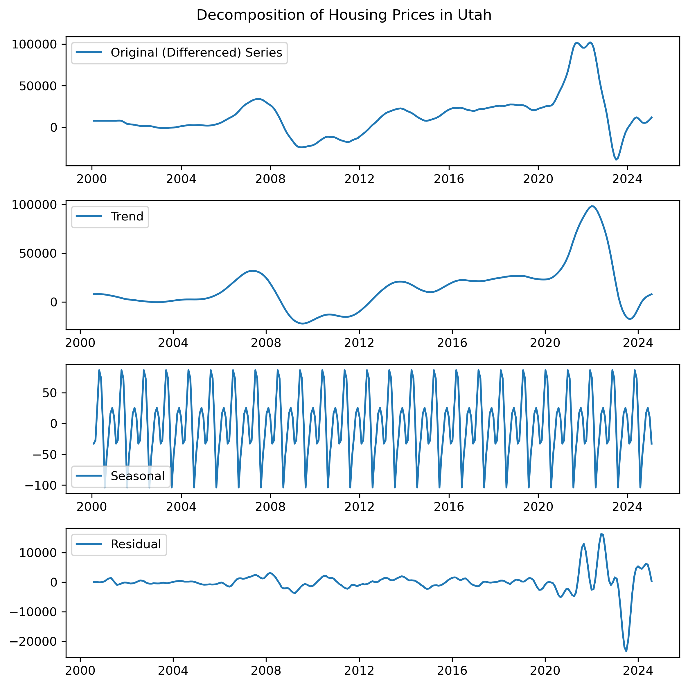
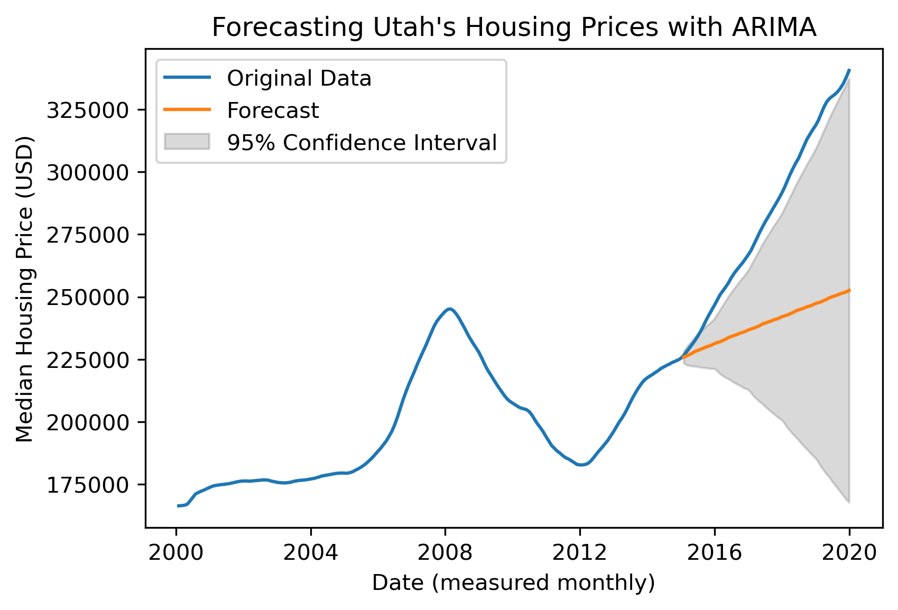
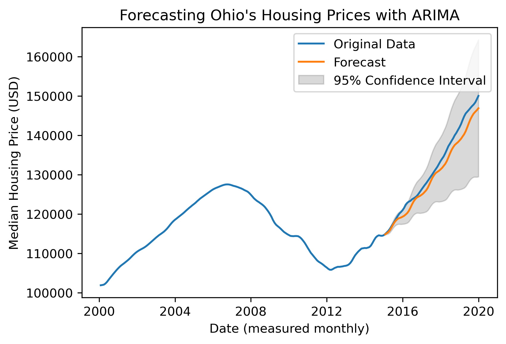
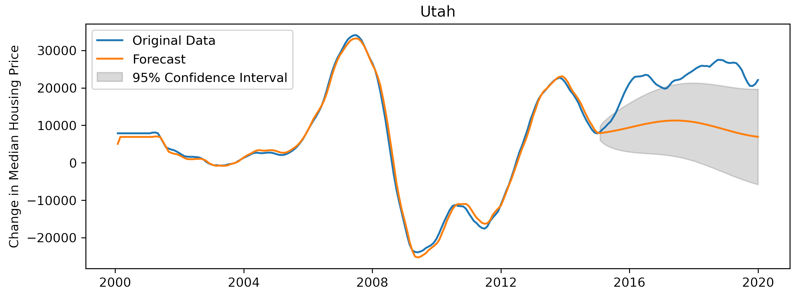
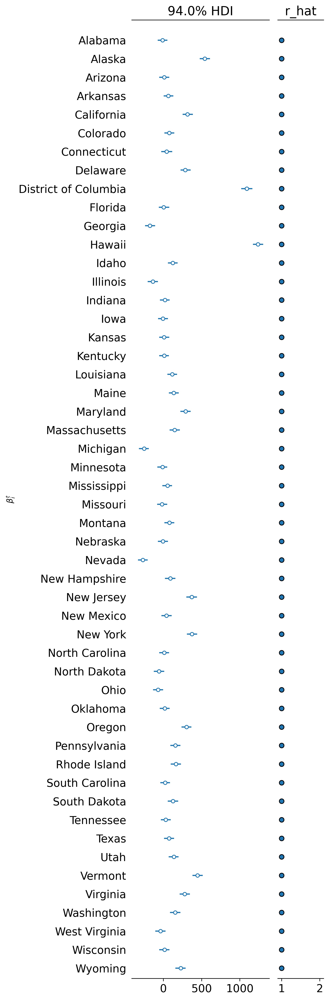
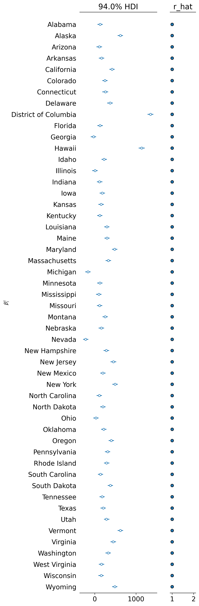
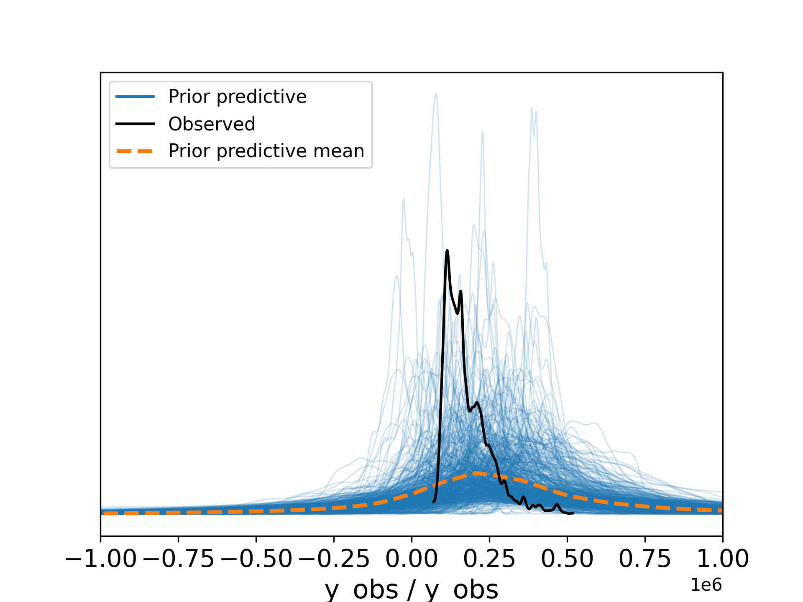
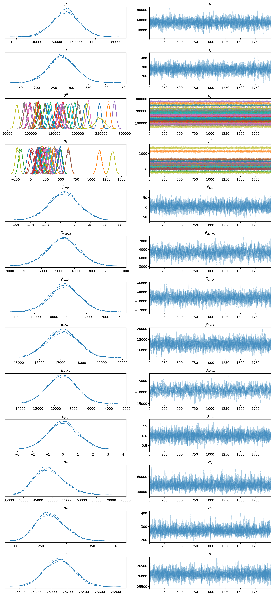

# Results

This page summarizes key empirical findings. See the paper for full detail; highlights are included here for quick review.

Clustering and regional dynamics
- Central states tend to cluster together across a range of cluster counts; coastal states (e.g., California, Florida) often form distinct small clusters.
- As the number of clusters increases (>7), singleton clusters appear frequently, suggesting diminishing returns to finer partitioning.

 

Seasonality and decomposition
- Many states exhibit a double-peaked seasonal pattern within a year.
- Residual volatility increases sharply post-2020, motivating the pre-2020 evaluation window.

Univariate ARIMA forecasting
- Typical best model ARIMA(4,1,0). Forecasts often extend recent linear trends; performance varies widely by state.
- Predictive intervals can grow large with horizon length; about 30/51 states had test data within 95% intervals.

 

VARMAX forecasting on clusters
- Cluster-based VARMAX better captures trend fluctuations than univariate ARIMA for non-trivial clusters; not applicable to singleton clusters.

Bayesian hierarchical model
- State-level slopes (growth rates) and intercepts (price level) differ substantially; DC and Hawaii show fastest growth; Nevada and Michigan among slowest (2000–2016).
- Standardized global covariates show correlations: higher Native/Asian/White shares associated with lower prices; higher Black share associated with rising prices (up to 2016).
- Trace plots indicate good mixing; prior predictive checks are broadly compatible with observed scales.

 

 

Ethical considerations (summary)
- Demographic variables should not guide individual decisions; risk of reinforcing bias or creating harmful feedback loops.
- Better use: policy insight and regional support targeting.

